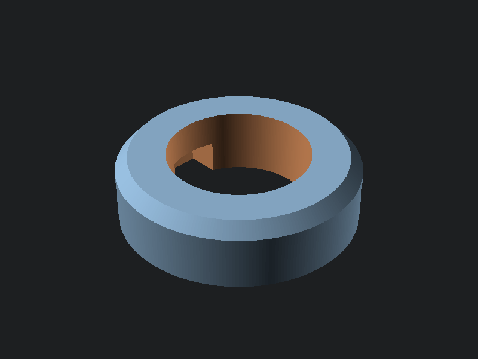
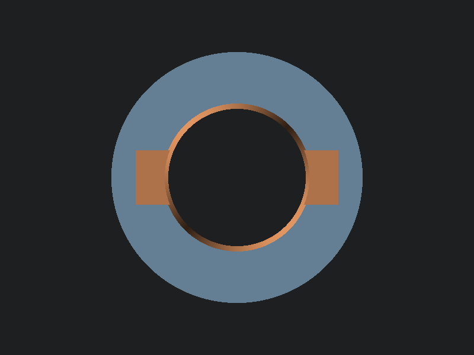
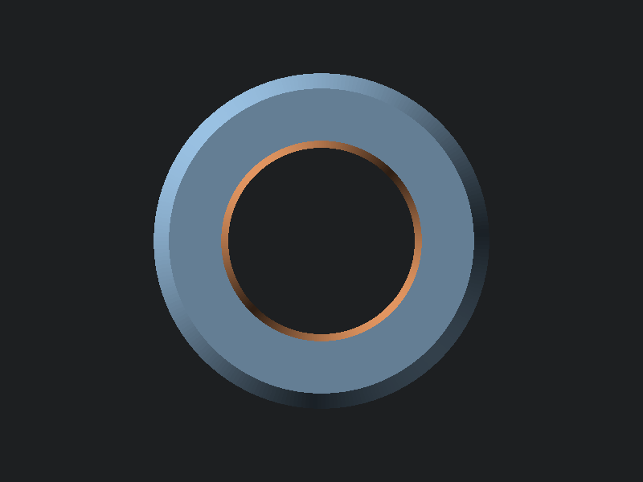

# Deck Chair Feet

Cylindrical foot cap with center hole, chamfered edge, and screwdriver notches for easy removal.

## Parameters

| Parameter | Default | Description |
|-----------|---------|-------------|
| outer_diameter | 36.5mm | Outer diameter |
| height | 10mm | Total height |
| hole_diameter | 21.5mm | Center hole diameter |
| chamfer | 2mm | Top edge chamfer |
| notch_width | 8mm | Screwdriver notch width |
| notch_depth | 4mm | Notch depth into wall |
| notch_height | 5mm | Notch height from bottom |

## Previews

